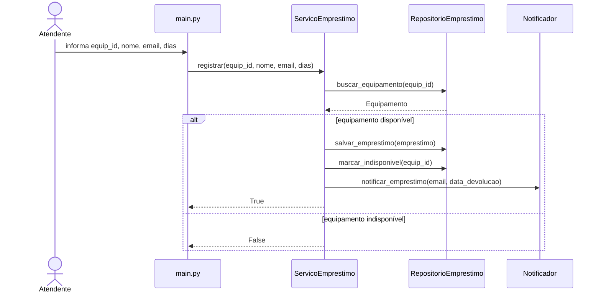
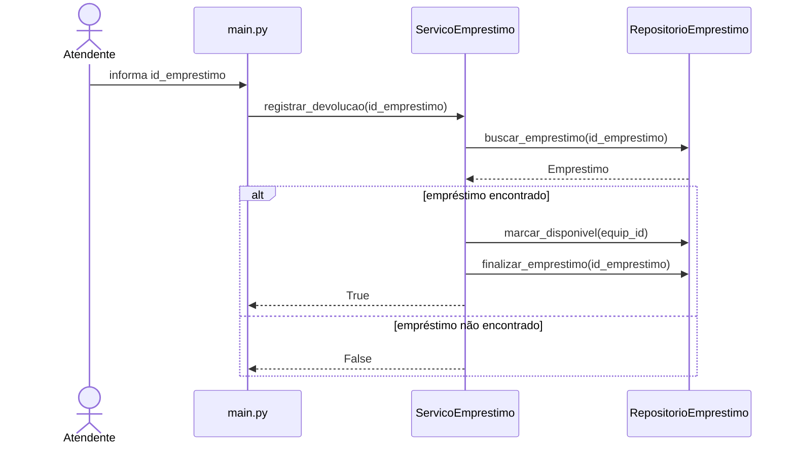
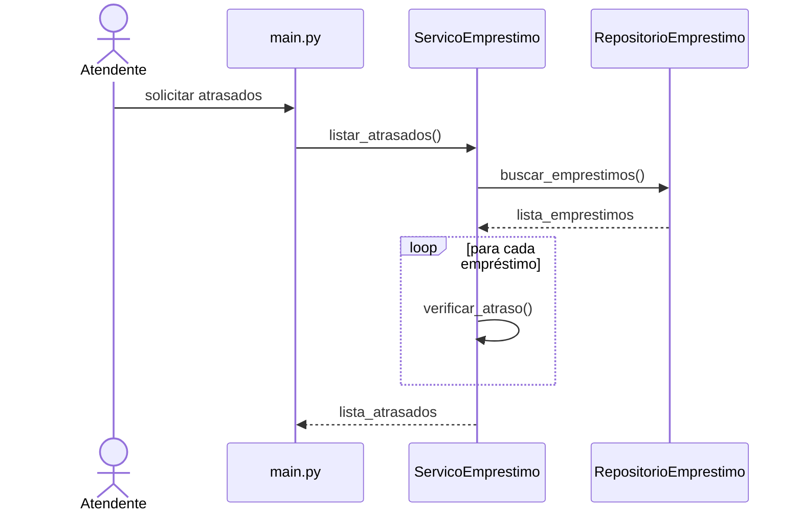

# Decomposição em camadas

## models/equipamento.py
Responsável por representar os equipamentos do sistema usando uma dataclass.

## models/emprestimo.py
Responsável por representar os empréstimos realizados no sistema.

## services/servico_emprestimo.py
Contém as regras de negócio relacionadas aos empréstimos.

## services/notificador.py
Responsável pelo envio de notificações aos usuários.

## repositories/repositorio_emprestimo.py
Responsável pelo armazenamento e recuperação de dados.

## main.py
Responsável pela interação com o usuário e fluxo principal do sistema.

---

# Diagramas de sequência

## UC01 — Registrar Empréstimo

## UC02 — Registrar Devolução

## UC03 — Listar Empréstimos em Atraso

